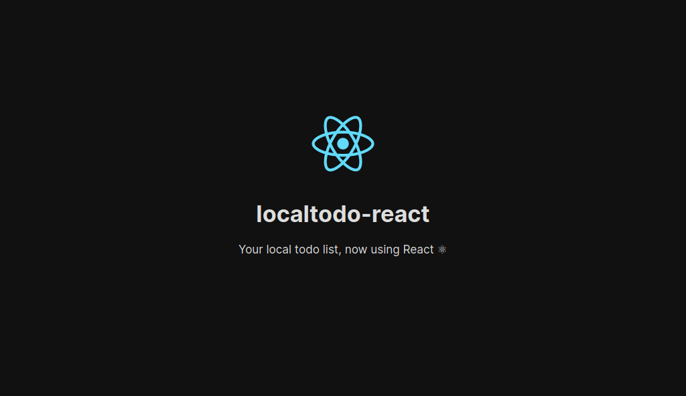

<!-- markdownlint-disable MD033 MD041 -->

<https://localtodo-react.now.sh>  
<https://localtodo-react.netlify.com>  
<https://localtodo-react.hostman.site>  
<https://localtodo-react-f5mol.ondigitalocean.app>  

